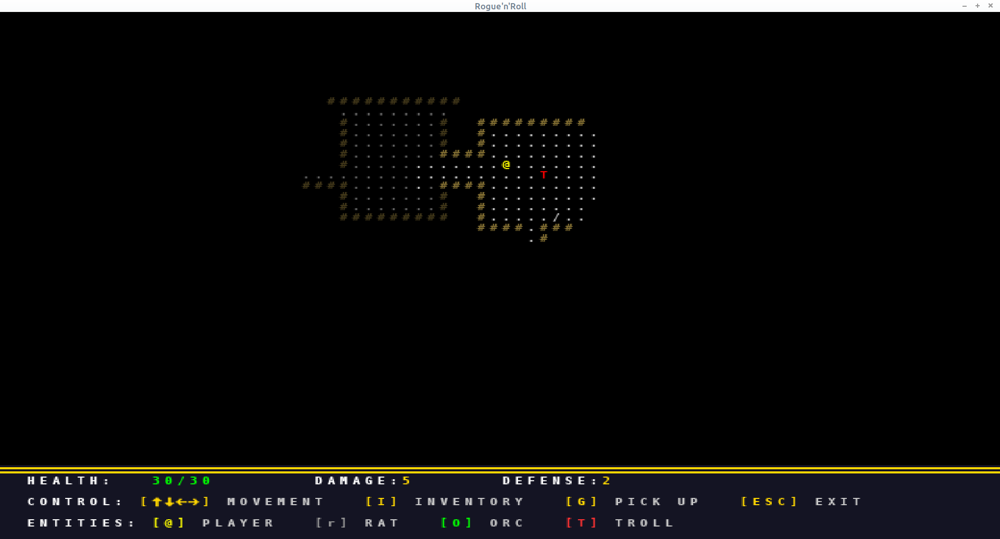

# Rogue'n'Roll

Классическая roguelike игра с современными элементами, написанная на Python.



Архитектура - [здесь](docs/architecture.md)

## Особенности

- Процедурная генерация подземелий
- Пошаговый геймплей
- Система боя
- Инвентарь и предметы
- Развитие персонажа
- Цветной консольный интерфейс

## Требования

- Python 3.10 или выше
- Poetry для управления зависимостями

## Установка

1. Клонируйте репозиторий:
```bash
git clone https://github.com/yourusername/rogue-n-roll.git
cd rogue-n-roll
```

2. Установите зависимости с помощью Poetry:
```bash
poetry install
```

## Запуск

```bash
poetry run python rogue_n_roll/main.py
```

## Управление

- `h/j/k/l` - движение влево/вниз/вверх/вправо
- `y/u/b/n` - движение по диагонали
- `g` - поднять предмет
- `i` - открыть инвентарь
- `q` - выйти из игры

## Разработка

Игра разработана с использованием следующих технологий и библиотек:

- Python 3.10+
- Poetry для управления зависимостями
- blessed для работы с терминалом
- numpy для работы с массивами

## Лицензия

MIT
