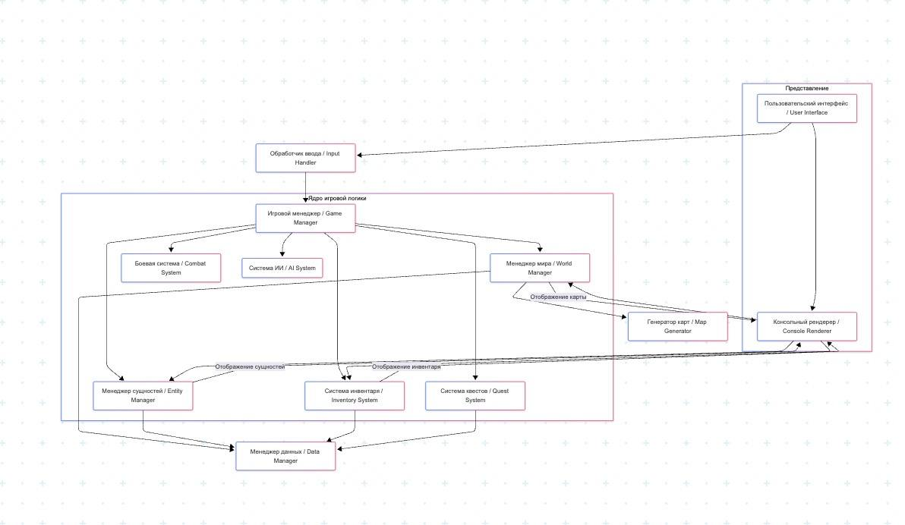

## Схема архитектуры

## Описание компонентов:

- **Пользовательский интерфейс**: Компонент, отвечающий за отображение информации игроку и получение команд. Включает отображение карты, статов, инвентаря, сообщений.

- **Обработчик ввода**: Считывает инпут и передает их в команды для игрового менеджера.

- **Консольный рендерер**: Отвечает за отрисовку всего игрового состояния в текстовой консоли.

- **Игровой менеджер**: Управляет основным игровым циклом, состояниями игры, передает команды от игрока соответствующим системам и координирует ходы NPC/монстров.

- **Менеджер мира**: Управляет текущей игровой картой. Загрузкой/генерацией, хранение данных о клетках, расположении предметов и сущностей на карте.

- **Генератор карт**: Отвечает за генерацию карт уровней или загрузку предопределенных карт из файлов.

- **Менеджер сущностей**: Управляет всеми активными сущностями в игре. Хранит их состояние, характеристики.

- **Боевая система**: Реализует логику боя: расчет урона, применение эффектов, проверка условий победы/поражения в столкновении.

- **Система инвентаря**: Управляет инвентарем персонажа и других сущностей. Обрабатывает подбор, выбрасывание, использование, надевание/снятие предметов.

- **Система квестов**: Управляет созданием, отслеживанием состояния и завершением квестов.

- **Система ИИ**: Определяет поведение монстров и NPC: перемещение, выбор цели, использование способностей.

- **Менеджер данных**: Отвечает за загрузку/сохранение игровых данных: определения предметов, монстров, шаблоны квестов, возможно, состояние игры.
