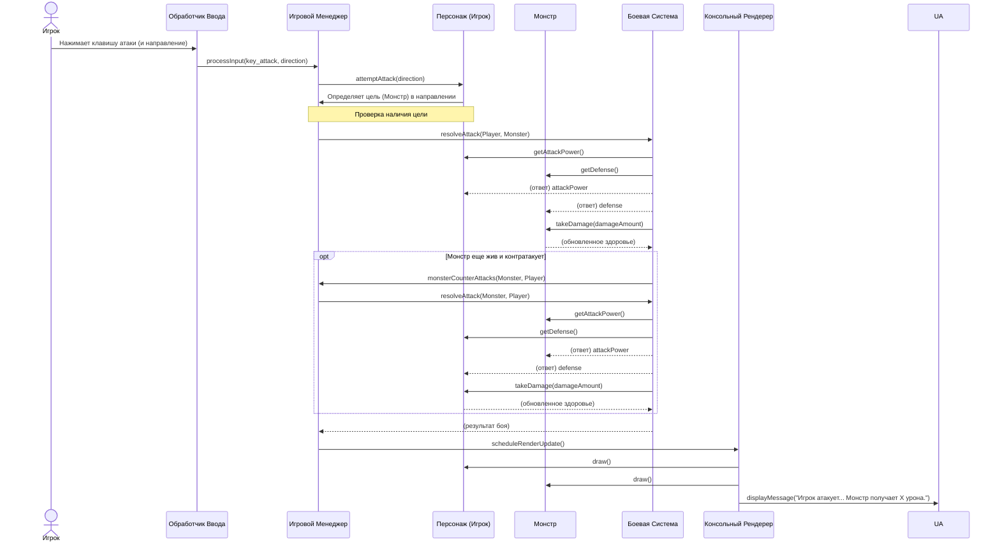
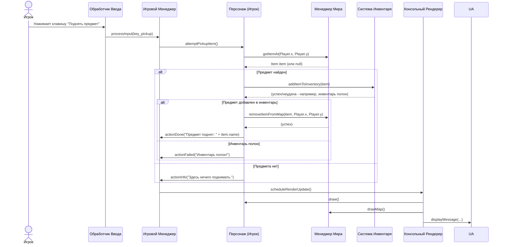
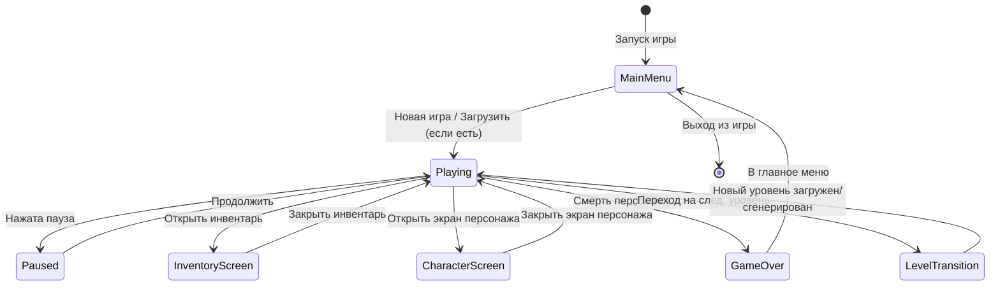

# Диаграммы взаимодействия
## Игрок атакует монстра

```mermaid
sequenceDiagram
    actor Игрок
    participant IH as Обработчик Ввода
    participant GM as Игровой Менеджер
    participant Player as Персонаж (Игрок)
    participant Monster as Монстр
    participant CS as Боевая Система
    participant CR as Консольный Рендерер

    Игрок->>IH: Нажимает клавишу атаки (и направление)
    IH->>GM: processInput(key_attack, direction)
    GM->>Player: attemptAttack(direction)
    Player->>GM: Определяет цель (Монстр) в направлении
    Note over Player,GM: Проверка наличия цели
    GM->>CS: resolveAttack(Player, Monster)
    CS->>Player: getAttackPower()
    CS->>Monster: getDefense()
    CS-->>Player: (ответ) attackPower
    CS-->>Monster: (ответ) defense
    CS->>Monster: takeDamage(damageAmount)
    Monster-->>CS: (обновленное здоровье)
    opt Монстр еще жив и контратакует
        CS->>GM: monsterCounterAttacks(Monster, Player)
        GM->>CS: resolveAttack(Monster, Player)
        CS->>Monster: getAttackPower()
        CS->>Player: getDefense()
        CS-->>Monster: (ответ) attackPower
        CS-->>Player: (ответ) defense
        CS->>Player: takeDamage(damageAmount)
        Player-->>CS: (обновленное здоровье)
    end
    CS-->>GM: (результат боя)
    GM->>CR: scheduleRenderUpdate()
    CR->>Player: draw()
    CR->>Monster: draw()
    CR->>UA: displayMessage("Игрок атакует... Монстр получает X урона.")
```

## Игрок поднимает предмет

```mermaid
sequenceDiagram
    actor Игрок
    participant IH as Обработчик Ввода
    participant GM as Игровой Менеджер
    participant Player as Персонаж (Игрок)
    participant WM as Менеджер Мира
    participant IS as Система Инвентаря
    participant CR as Консольный Рендерер

    Игрок->>IH: Нажимает клавишу "Поднять предмет"
    IH->>GM: processInput(key_pickup)
    GM->>Player: attemptPickupItem()
    Player->>WM: getItemAt(Player.x, Player.y)
    WM-->>Player: Item item (или null)
    alt Предмет найден
        Player->>IS: addItemToInventory(item)
        IS-->>Player: (успех/неудача - например, инвентарь полон)
        alt Предмет добавлен в инвентарь
            Player->>WM: removeItemFromMap(item, Player.x, Player.y)
            WM-->>Player: (успех)
            Player->>GM: actionDone("Предмет поднят: " + item.name)
        else Инвентарь полон
            Player->>GM: actionFailed("Инвентарь полон!")
        end
    else Предмета нет
        Player->>GM: actionInfo("Здесь нечего поднимать.")
    end
    GM->>CR: scheduleRenderUpdate()
    CR->>Player: draw()
    CR->>WM: drawMap()
    CR->>UA: displayMessage(...)
```

## Состояние игры

```mermaid
stateDiagram-v2
    [*] --> MainMenu : Запуск игры
    MainMenu --> Playing : Новая игра / Загрузить (если есть)
    Playing --> Paused : Нажата пауза
    Paused --> Playing : Продолжить
    Playing --> InventoryScreen : Открыть инвентарь
    InventoryScreen --> Playing : Закрыть инвентарь
    Playing --> CharacterScreen : Открыть экран персонажа
    CharacterScreen --> Playing : Закрыть экран персонажа
    Playing --> GameOver : Смерть персонажа
    GameOver --> MainMenu : В главное меню
    MainMenu --> [*] : Выход из игры
    Playing --> LevelTransition : Переход на след. уровень
    LevelTransition --> Playing : Новый уровень загружен/сгенерирован
```
