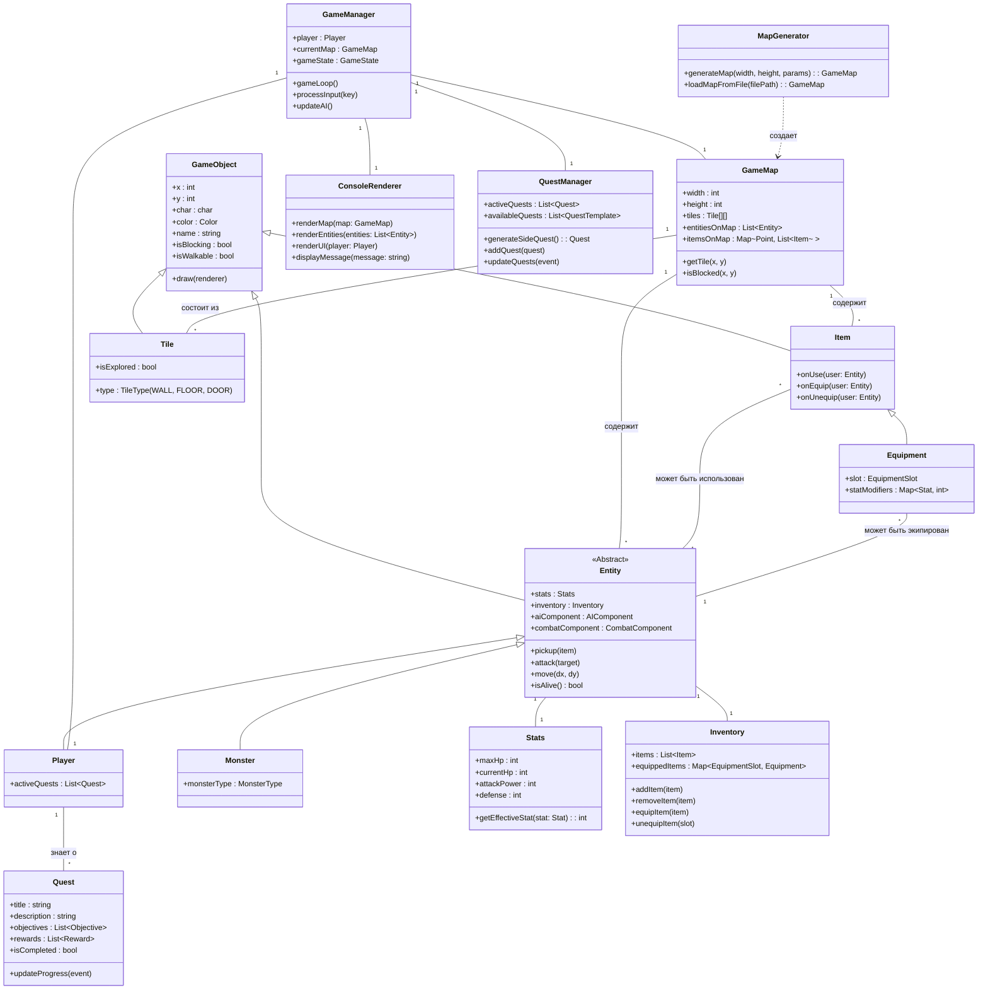

# Логическая структура

# Описание

Описание классов:

- **GameObject**: Базовый класс для всех объектов, имеющих представление на карте (координаты, символ, цвет).
- **Entity**: Абстрактный класс для всех "живых" существ (игрок, монстры). Содержит характеристики (Stats), инвентарь (Inventory), компоненты поведения (AI, бой).
- **Player**: Представляет персонажа игрока. Наследуется от Entity, добавляет специфичные для игрока данные (например, активные квесты).
- **Monster**: Представляет монстра. Наследуется от Entity, может иметь тип, специфичное поведение.
- **Item**: Базовый класс для всех предметов. Может быть использован, подобран.
- **Equipment**: Подкласс Item, представляющий экипируемые предметы (оружие, броня). Имеет слот экипировки и модификаторы характеристик.
- **Stats**: Хранит и управляет характеристиками сущности (здоровье, сила и т.д.). Может учитывать эффекты от экипировки/баффов.
- **Inventory**: Управляет предметами, которые несет сущность, и теми, что надеты.
- **Tile**: Представляет одну клетку карты (стена, пол, дверь и т.д.).
- **GameMap**: Хранит двумерный массив тайлов, а также списки сущностей и предметов, находящихся на карте.
- **GameManager**: Оркестрирует основной игровой процесс, управляет состоянием игры.
- **MapGenerator**: Отвечает за создание и загрузку объектов GameMap.
- **ConsoleRenderer**: Отвечает за отображение игрового мира и интерфейса в консоли.
- **Quest**: Представляет задание с целями, описанием и наградами.
- **QuestManager**: Управляет жизненным циклом квестов, включая их генерацию.
